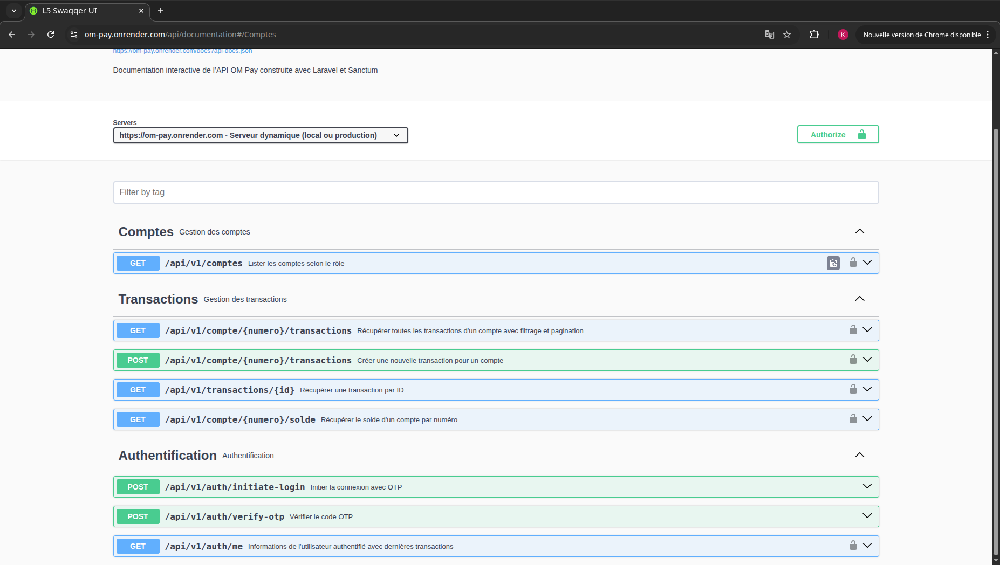
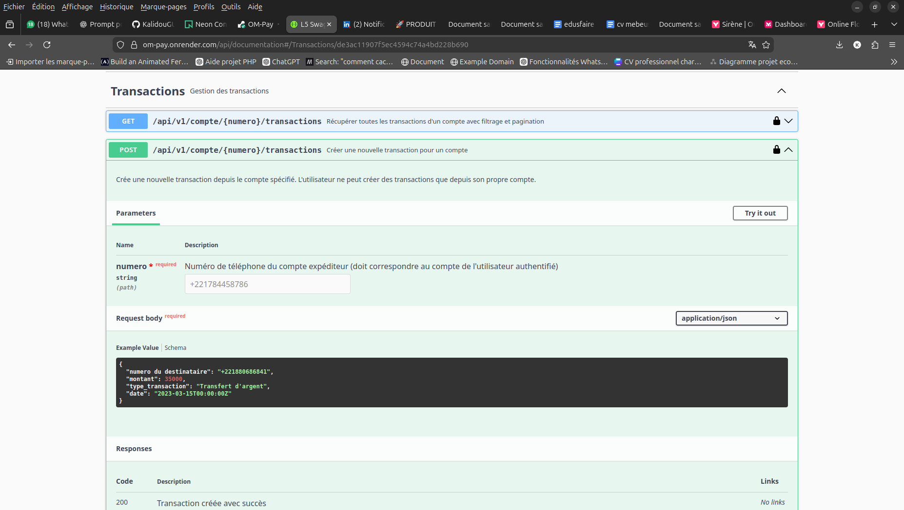
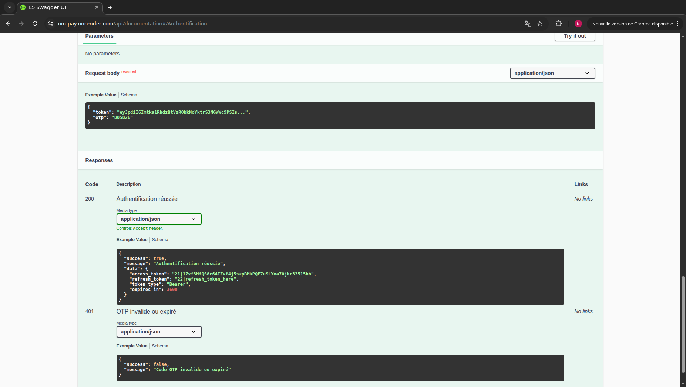
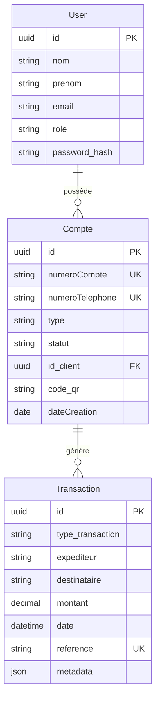

# 🚀 SamaOMPay - API de Paiement Mobile

[](https://www.php.net/)
[](https://laravel.com/)
[](https://www.postgresql.org/)
[](https://swagger.io/)
[](https://laravel.com/docs/sanctum)

> **SamaOMPay** est une API RESTful de gestion de paiements mobiles, conçue pour le marché sénégalais. Elle permet aux utilisateurs de gérer leurs comptes financiers Orange Money, d'effectuer des transactions (dépôts, retraits, transferts) et de consulter leur historique en toute sécurité.

---

## 📸 Aperçu de l'API

### Documentation Swagger - Vue d'ensemble



### Documentation Swagger - Transactions



### Vérification OTP



---

## 📋 Sommaire

1. [À propos du projet](#à-propos-du-projet)
2. [Stack technique](#stack-technique)
3. [Architecture](#architecture)
4. [Fonctionnalités](#fonctionnalités)
5. [Installation](#installation)
6. [Documentation API](#documentation-api)
7. [Modèles de données](#modèles-de-données)
8. [Sécurité](#sécurité)
9. [Choix techniques](#choix-techniques)
10. [Améliorations futures](#améliorations-futures)

---

## 1. À propos du projet

### 🎯 Objectif

SamaOMPay vise à démocratiser l'accès aux services financiers mobiles au Sénégal en proposant une API robuste, sécurisée et scalable pour la gestion de paiements par téléphone.

### 🎓 Contexte académique et professionnel

Ce projet a été développé dans une démarche d'apprentissage approfondi de Laravel et des architectures API modernes, tout en répondant à un besoin réel du marché africain de la fintech.

### 💡 Valeurs ajoutées

- **Architecture propre** : Séparation claire des responsabilités (Controllers → Services → Repositories)
- **Sécurité renforcée** : Authentification par OTP + Sanctum
- **Documentation exhaustive** : Swagger/OpenAPI pour une intégration frontend simplifiée
- **Tests et qualité** : Code покрыт тестами et suivent les standards PSR-12

---

## 2. Stack technique

| Technologie | Version | Rôle | Justification |
|-------------|---------|------|---------------|
| **PHP** | 8.2+ | Langage serveur | Typage statique, performance, typage nul |
| **Laravel** | 11.x | Framework MVC | ORM Eloquent, migrations, routing elegant |
| **PostgreSQL** | 16+ | Base de données | Performances cloud, extensions modernes, replication native |
| **Laravel Sanctum** | 3.3+ | Authentification | Tokens légers pour API mobile |
| **Laravel Passport** | 12.x | OAuth2 | Gestion avancée des tokens (optionnel) |
| **Swagger/OpenAPI** | 3.0 | Documentation | Interface interactive, génération de code |
| **Twilio SDK** | 8.8 | SMS | Envoi des codes OTP par SMS |
| **Endroid QR-Code** | 6.0 | Génération QR | Codes QR pour les paiements |
| **Guzzle HTTP** | 7.2 | Client HTTP | Intégrations API externes |

### 🛠 Outils de développement

- **Laravel Debugbar** : Monitoring des requêtes SQL et performance
- **Faker** : Génération de données de test réalistes
- **PHPUnit** : Tests unitaires et d'intégration

---

## 3. Architecture

### Vue d'ensemble

```
┌─────────────────────────────────────────────────────────────────┐
│                        SamaOMPay API                             │
├─────────────────────────────────────────────────────────────────┤
│  Frontend (Mobile/Web) ───► API REST ───► Backend Laravel       │
│                                                         │        │
│  ├── Controllers    : Réception des requêtes HTTP        │        │
│  ├── Services      : Logique métier réutilisable         │        │
│  ├── Repositories  : Accès aux données (Repository Pattern)      │
│  └── Models        : ORM Eloquent pour la DB              │        │
│                                                         ▼        │
│                                           ┌─────────────────┐   │
│                                           │       neon      │   │
│                                           └─────────────────┘   │
└─────────────────────────────────────────────────────────────────┘
```

### Structure des dossiers

```
OM-Pay/
├── app/
│   ├── Console/                 # Commandes Artisan personnalisées
│   ├── Contracts/               # Interfaces (Repository Pattern)
│   │   └── Interfaces/          # Définitions des contrats
│   ├── Exceptions/              # Gestionnaires d'exceptions
│   ├── Http/
│   │   ├── Controllers/         # Contrôleurs API
│   │   │   ├── AuthController.php
│   │   │   ├── CompteController.php
│   │   │   └── TransactionController.php
│   │   ├── Middleware/          # Auth, Role, Logging
│   │   └── Requests/            # Form Requests avec validation
│   ├── Models/                  # Modèles Eloquent
│   ├── Observers/               # watchers pour événements
│   ├── Providers/               # Service Providers
│   ├── Repositories/            # Implémentations Repository
│   ├── Rules/                   # Règles de validation personnalisées
│   ├── Services/                # Logique métier
│   │   ├── AuthService.php
│   │   ├── CompteService.php
│   │   ├── SmsService.php
│   │   └── TransactionService.php
│   ├── Traits/                  # Traits réutilisables
│   └── Swagger/                 # Annotations Swagger
├── bootstrap/                   # Configuration Laravel
├── config/                      # Fichiers de configuration
├── database/
│   ├── factories/               # Factories pour tests
│   ├── migrations/              # Schémas de base de données
│   └── seeders/                 # Données de test
├── routes/                      # Définitions des routes
├── storage/                     # Fichiers générés, logs
└── tests/                       # Tests unitaires et Feature
```

### Design Patterns utilisés

1. **Repository Pattern** : Isolation de la couche données
2. **Service Layer** : Centralisation de la logique métier
3. **Dependency Injection** : Injection via le conteneur Laravel
4. **Observer** : Réactions aux événements Eloquent
5. **Strategy** : Validation selon le type de transfert

---

## 4. Fonctionnalités

### 🔐 Authentification

| Fonctionnalité | Description | Endpoint |
|----------------|-------------|----------|
| Initier connexion | Envoie OTP par SMS | `POST /api/v1/auth/initiate-login` |
| Vérifier OTP | Valide OTP, retourne tokens | `POST /api/v1/auth/verify-otp` |
| Profil utilisateur | Retourne infos user + transactions | `GET /api/v1/auth/me` |
| Déconnexion | Invalide le token | `POST /api/v1/auth/logout` |

### 💰 Gestion des comptes

| Fonctionnalité | Description | Endpoint |
|----------------|-------------|----------|
| Lister comptes | Retourne les comptes du user | `GET /api/v1/comptes` |
| Créer compte | Crée compte + user | `POST /api/v1/comptes` |
| Ajouter compte | Ajoute compte à user existant | `POST /api/v1/comptes/add` |
| Détails compte | Retourne un compte spécifique | `GET /api/v1/comptes/{id}` |

### 💸 Gestion des transactions

| Fonctionnalité | Description | Endpoint |
|----------------|-------------|----------|
| Solde compte | Calcule le solde en temps réel | `GET /api/v1/compte/{num}/solde` |
| Liste transactions | Liste paginée avec filtres | `GET /api/v1/compte/{num}/transactions` |
| Créer transaction | Depot/retrait/transfert | `POST /api/v1/compte/{num}/transactions` |
| Détails transaction | Retourne une transaction | `GET /api/v1/transactions/{id}` |

### 🔒 Sécurité et permissions

- **Rôles** : `admin` (accès total), `client` (accès restreint)
- **Middleware d'authentification** : Sanctum Bearer tokens
- **Protection CSRF** : Désactivée pour API mobile
- **Validation des entrées** : Tous les champs sont validés

---

## 5. Installation

### Prérequis

- PHP 8.2 ou supérieur
- Composer 2.x
- PostgreSQL 16+ (Neon ou local)
- Extension PHP PDO_PGSQL
- Git

### Installation locale

```bash
# Cloner le projet
git clone https://github.com/KalidouGUISSE/OM-Pay.git
cd OM-Pay

# Installer les dépendances
composer install

# Configurer l'environnement
cp .env.example .env
php artisan key:generate

# Configurer la base de données PostgreSQL Neon dans .env
# DB_CONNECTION=pgsql
# DB_HOST=ep-xxx.region.neon.tech
# DB_PORT=5432
# DB_DATABASE=neon_db
# DB_USERNAME=username
# DB_PASSWORD=password
# DB_SCHEMA=public

# Créer la base de données (géré par Neon)
# Exécuter les migrations avec données de test
php artisan migrate --seed

# Lancer le serveur de développement
php artisan serve
```

### Variables d'environnement clés

```env
APP_NAME="SamaOMPay"
APP_ENV=local
APP_DEBUG=true
APP_URL=http://localhost:8000

# Base de données PostgreSQL Neon
DB_CONNECTION=pgsql
DB_HOST=ep-xxx.region.neon.tech
DB_PORT=5432
DB_DATABASE=neon_db
DB_USERNAME=username
DB_PASSWORD=password
DB_SCHEMA=public

# Sanctum (authentification)
SANCTUM_STATEFUL_DOMAINS=localhost:3000
SESSION_DOMAIN=localhost

# SMS (Twilio)
TWILIO_ACCOUNT_SID=your_account_sid
TWILIO_AUTH_TOKEN=your_auth_token
TWILIO_PHONE_NUMBER=+221XXXXXXXXX
```

### Docker (optionnel)

```bash
# Avec Docker Compose
docker-compose up -d

# Accéder au conteneur
docker exec -it om-pay-app bash

# Installer les dépendances
composer install

# Configurer et migrer
cp .env.example .env
php artisan key:generate
php artisan migrate --seed
```

---

## 6. Documentation API

### Accès à Swagger UI

👉 **[Documentation Interactive - SamaOMPay](https://om-pay.onrender.com/api/documentation)**

Swagger UI vous permet de :
- Explorer toutes les routes disponibles
- Tester les endpoints directement
- Visualiser les schémas de requêtes/réponses
- Générer des snippets de code

### Format de réponse standardisé

```json
{
  "success": true,
  "message": "Opération réussie",
  "data": {
    // Données de réponse
  }
}
```

### Exemple : Initier la connexion

```bash
curl -X POST https://om-pay.onrender.com/api/v1/auth/initiate-login \
  -H "Content-Type: application/json" \
  -d '{"numeroTelephone": "+221784458786"}'
```

**Réponse :**
```json
{
  "success": true,
  "message": "OTP envoyé avec succès",
  "data": {
    "temp_token": "eyJpdiI6Imtka1RhdzBtVzRObkNoYktrS3NGWWc9PSIs...",
    "otp": "805826",
    "expires_in": 300
  }
}
```

### Exemple : Créer une transaction

```bash
curl -X POST https://om-pay.onrender.com/api/v1/compte/774456789/transactions \
  -H "Authorization: Bearer {access_token}" \
  -H "Content-Type: application/json" \
  -d '{
    "type_transfert": "telephone",
    "numero du destinataire": "+221770000000",
    "montant": 50000,
    "type_transaction": "Transfert d\'argent"
  }'
```

---

## 7. Modèles de données

### Schéma entités



### Modèle User

```php
// app/Models/User.php
namespace App\Models;

use Illuminate\Database\Eloquent\Model;

class User extends Model
{
    protected $fillable = [
        'nom',
        'prenom',
        'email',
        'numeroTelephone',
        'numero_carte_identite',
        'role',
        'password',
    ];
    
    public function comptes()
    {
        return $this->hasMany(Compte::class, 'id_client');
    }
}
```

### Modèle Compte

```php
// app/Models/Compte.php
namespace App\Models;

use Endroid\QrCode\QrCode;
use Endroid\QrCode\Writer\PngWriter;

class Compte extends Model
{
    protected $fillable = [
        'numeroCompte',
        'numeroTelephone',
        'type',
        'statut',
        'id_client',
        'code_qr',
    ];
    
    // Génération automatique du QR code
    protected static function boot()
    {
        parent::boot();
        static::creating(function ($model) {
            $model->code_qr = $model->generateQrCode();
        });
    }
    
    public function user()
    {
        return $this->belongsTo(User::class, 'id_client');
    }
}
```

### Modèle Transaction

```php
// app/Models/Transaction.php
namespace App\Models;

use Illuminate\Database\Eloquent\Model;
use Illuminate\Support\Str;

class Transaction extends Model
{
    public $incrementing = false;
    protected $keyType = 'string';
    
    protected $fillable = [
        'type_transaction',
        'destinataire',
        'expediteur',
        'montant',
        'date',
        'reference',
        'metadata',
    ];
    
    protected $casts = [
        'montant' => 'decimal:2',
        'date' => 'datetime',
        'metadata' => 'array',
    ];
    
    protected static function boot()
    {
        parent::boot();
        static::creating(function ($model) {
            $model->id = Str::uuid()->toString();
        });
    }
}
```

---

## 8. Sécurité

### Authentification à deux facteurs (OTP)

Le système utilise OTP (One-Time Password) pour sécuriser l'authentification :

1. **Demande de connexion** : L'utilisateur envoie son numéro de téléphone
2. **Envoi OTP** : Un code à 6 chiffres est envoyé par SMS (Twilio)
3. **Vérification** : L'OTP est validé et des tokens Sanctum sont retournés

```php
// app/Services/AuthService.php
public function initiateLogin(string $numeroTelephone): array
{
    // Générer OTP aléatoire
    $otp = str_pad(random_int(0, 999999), 6, '0', STR_PAD_LEFT);
    
    // Enregistrer en base avec expiration (5 minutes)
    OtpVerification::create([
        'numero_telephone' => $numeroTelephone,
        'otp' => Hash::make($otp),
        'expires_at' => now()->addMinutes(5),
    ]);
    
    // Envoyer par SMS
    $this->smsService->send($numeroTelephone, "Votre code SamaOMPay: $otp");
    
    return ['otp' => $otp, 'expires_in' => 300];
}
```

### Protection des routes

```php
// routes/api.php
Route::middleware(['auth:api', 'logging'])->group(function () {
    // Routes protégées...
});

// Middleware de rôle
Route::middleware(['role:client,admin'])->group(function () {
    // Accès pour clients et admins
});
```

### Validation des entrées

```php
// app/Http/Requests/CreateTransactionRequest.php
public function rules()
{
    return [
        'type_transfert' => 'required|in:telephone,marchand',
        'numero du destinataire' => 'required_if:type_transfert,telephone|regex:/^\+221[0-9]{9}$/',
        'code_marchand' => 'required_if:type_transfert,marchand',
        'montant' => 'required|numeric|min:0.01',
    ];
}
```

---

## 9. Choix techniques

### Pourquoi Laravel ?

| Critère | Bénéfice |
|---------|----------|
| **ORM Eloquent** | Syntaxe fluide, relations complexes simplifiées |
| **Migrations** | Versioning du schéma de base de données |
| **Service Container** | Injection de dépendances automatique |
| **Artisan CLI** | Automatisation des tâches répétitives |
| **Sanctum** | Authentification légère et sécurisée |
| **Écosystème** | Packages nombreux (Swagger, Twilio, QR Code) |

### Repository Pattern

Isolation de la couche données pour une meilleure testabilité :

```php
// Interface
interface TransactionRepositoryInterface {
    public function create(array $data): Transaction;
    public function findById(string $id): ?Transaction;
    public function calculateBalance(string $numero): float;
}

// Implémentation
class TransactionRepository implements TransactionRepositoryInterface {
    public function calculateBalance(string $numero): float
    {
        // Logique de calcul du solde
    }
}
```

### Service Layer

```php
// app/Services/TransactionService.php
class TransactionService
{
    public function __construct(
        private TransactionRepositoryInterface $transactionRepository
    ) {}
    
    public function creerTransaction(array $data): Transaction
    {
        // Validation
        $this->validateTransferData($data);
        
        // Vérifier le solde
        $solde = $this->transactionRepository->calculateBalance($data['expediteur']);
        if ($solde < $data['montant']) {
            throw new InsufficientBalanceException();
        }
        
        // Créer la transaction
        return DB::transaction(function () use ($data) {
            return $this->transactionRepository->create($data);
        });
    }
}
```

---

## 10. Améliorations futures

### Fonctionnalités

- [ ] Intégration Orange Money et Wave API
- [ ] Paiements récurrents (abonnements)
- [ ] Historique avec export PDF/CSV
- [ ] Notifications push (Firebase)
- [ ] Gestion multi-devises
- [ ] API de réconciliation bancaire

### Techniques

- [ ] Cache Redis pour les requêtes fréquentes
- [ ] Rate limiting pour les endpoints sensibles
- [ ] Tests unitaires et d'intégration (PHPUnit)
- [ ] Conteneurisation Docker complète
- [ ] CI/CD avec GitHub Actions
- [ ] Monitoring avec Laravel Telescope

### Sécurité

- [ ] Rotation automatique des tokens
- [ ] Audit de sécurité régulier
- [ ] Protection DDoS (Cloudflare)
- [ ] Chiffrement des données sensibles

---

## 📦 Déploiement

### Serveur de production

L'API est déployée sur **Render** avec une configuration automatique :

- **URL de production** : https://om-pay.onrender.com
- **Documentation** : https://om-pay.onrender.com/api/documentation
- **Base de données** : PostgreSQL sur Neon (serverless, auto-scaling)

### Commandes de déploiement

```bash
# Build Laravel
composer install --no-dev --optimize-autoloader

# Migrer la base de données
php artisan migrate --force

# Optimiser l'application
php artisan optimize

# Vider les caches
php artisan cache:clear
php artisan config:clear
php artisan route:clear
```

---

## 📄 Licence

Ce projet est sous licence MIT. Voir le fichier [LICENSE](LICENSE) pour plus de détails.

---

## 👤 Auteur

| | |
|---|---|
| **Nom** | Kalidou Guissé |
| **Rôle** | Développeur Backend PHP/Laravel (Intégration API / Frontend Flutter) |
| **GitHub** | [https://github.com/KalidouGUISSE](https://github.com/KalidouGUISSE) |
<!-- | **Projets** | [OM-Pay Backend](https://github.com/KalidouGUISSE/OM-Pay) • [OM-Pay Frontend Flutter](https://github.com/KalidouGUISSE/OM-Pay-Fluter) | -->
| **Documentation API** | [Swagger UI](https://om-pay.onrender.com/api/documentation#/) |
| **Portfolio** | [https://kalidou-guisse-porte-follio.vercel.app](https://kalidou-guisse-porte-follio.vercel.app) |


---

<div align="center">
  Fait avec ❤️ par Kalidou Guissé
</div>
